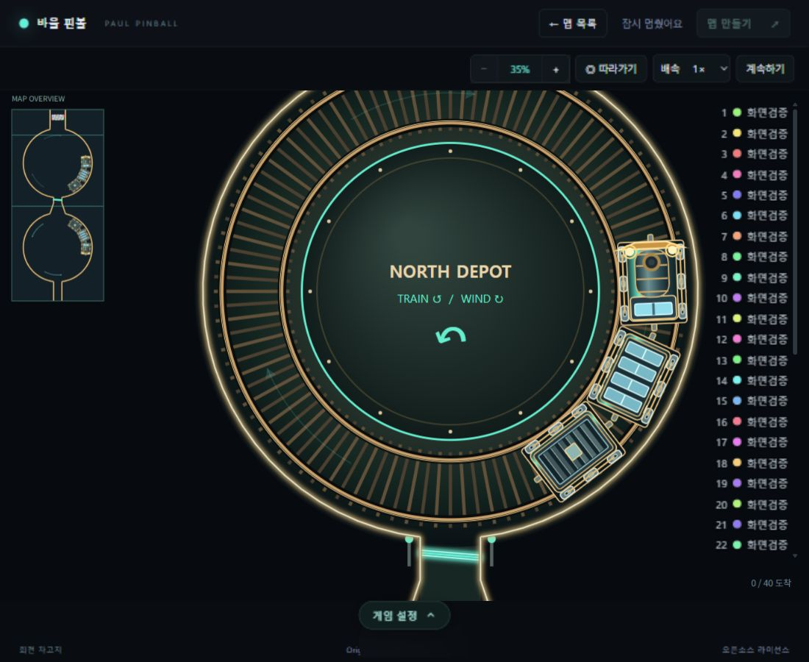

# 핀볼 개선 적용 결과 — 2026-09-29

`main`의 `315c63d`를 기준으로 [검토 보고서](pinball-review-2026-09-29.md)의 개선 항목을 구현·검증했습니다. 차고지 정적 배경 캐시는 비교 측정에서 효과가 없어 제외했습니다. Box2D 엔진과 고정 물리 시간 간격, 4/16회 서브스텝, 충돌 형상과 solver 반복 설정은 유지했습니다. 커밋과 배포는 수행하지 않았습니다.

## 적용 내용

| 영역 | 변경 | 확인 방법 |
|---|---|---|
| 순간 충돌 | 물리 서브스텝 전체에서 파괴 장애물 접촉을 누적하여 짧은 반사를 놓치지 않게 수정 | 실제 WASM에서 4/16분할·고속 반사·이동 장애물 회귀 테스트 |
| LAN 스프링 | 명령에 scene revision을 포함하고, 요청 처리 직전 장치 삭제를 반영하여 이전 배열 번호 거절 | 실제 WebSocket에서 장애물 파괴 후 이전 요청 거절·새 요청 작동 |
| 물리 CPU | 스프링·슬라이더·회전 장치·부스터·파괴 장치 목록을 구분하고, 정적 pose getter와 반복 바람 계산 제거 | 정적 getter·바람 함수 호출 수, 기존 맵 완주·접촉 테스트 |
| 상태 조회 | Game 및 LAN 방송에서 이미 얻은 엔티티 상태 재사용, LAN 화면 객체와 프레임별 위치 자료 재사용 | 브라우저 조회 횟수, LAN 보간·카메라·장치 테스트 |
| 벽 격자 | 벽의 전체 경계 사각형 대신 실제 선분 통과 셀을 등록 | 대각선·격자 모서리·방향·충돌 레이어 비교 |
| 사용자 맵 | 전체 충돌 형상 10,000개, 벽 격자 보수적 비용 100,000, 정규화된 맵·내보내기 파일 1,000,000바이트 제한, 구버전 원본 가져오기는 2,000,000바이트까지 허용 | 모든 기본 맵 통과, 과도한 입력 거절, UTF-8·정규화 후 정확한 한도·내보내기 재가져오기 |
| LAN 파일 크기 | 실제 직렬화된 명령의 UTF-8 크기를 전송 전에 검사, 서버와 1MiB 상한 공유 | 한도와 한도+1바이트, 한글 입력, 실제 소켓 크기 제한 |
| 배경 메모리 | 전체 맵 배경에 24×1024² 픽셀 LRU 예산, 이미지별 16×1024² 상한, 퇴출 캔버스 해제 | 맵 전환·큰 맵·오비탈 여러 레이어 재사용 테스트 |
| 확대 렌더 | 구슬 해상도 구간 캐시, 이름표 별도 캐시, 화면 밖 장치·열차 아트 생략 | 연속 확대 캐시 생성량·렌더 p95, 기존 입력·미니맵 회귀 테스트 |
| 유휴 렌더 | 대기·일시정지·종료 시 약 10Hz로 그리기 제한, 카메라 이동·입력·녹화·당첨 효과는 계속 갱신 | 대기 그리기 횟수, 녹화·입력·축하 효과 테스트 |
| WASM 수명 | 빌린 wrapper를 추적하고 월드 비움 시 JS 캐시 정리, 명시적인 dispose 추가 | 반복 맵 초기화 후 캐시 잔존·살아 있는 body 동일성·재초기화 테스트 |
| 프로젝트 구조 | StageDef를 맵 레지스트리에서 분리, IPhysics 실제 계약 정렬, 일반/LAN 맵 저장을 MapLibrary로 통합 | 공유 재사용 지점 타입 검사, 저장 실패 시 기존 상태 보존·저장/복원 테스트 |
| 검증 체계 | 서버 checkJs와 공유 프로토콜 타입 연결, 단위/맵/LAN 테스트 명령 분리, PR 검증 및 LAN 빌드 CI 추가 | 로컬 전체 테스트와 두 배포 빌드 |

배경 픽셀 예산은 RGBA 4바이트 단순 환산으로 약 96MiB입니다. 이는 배경 캐시의 픽셀 한도이며 브라우저 전체 메모리나 GPU 사용량 측정값이 아닙니다. 큰 사용자 맵은 이 예산에 맞춰 배경 래스터 해상도가 낮아질 수 있습니다.

스프링 명령 형식이 바뀌었으므로 LAN 서버와 화면 파일은 같은 버전으로 빌드해 사용해야 합니다. 기존 맵 파일 형식은 유지하며, 새 비용·크기 한도를 넘는 사용자 맵은 오류 안내와 함께 거절합니다. 이름이나 맵이 커서 LAN 명령이 1MiB를 넘으면 연결을 끊기 전에 화면에서 오류를 안내합니다.

## 브라우저 비교

같은 PC의 Codex 내장 브라우저, 캔버스 1000×600 CSS 픽셀, DPR 1, 난수 시드 123456에서 기준 버전과 개선 버전을 각각 측정했습니다. 워밍업 2초 뒤 12초를 기록했으며, 측정 중 빌드와 부하 테스트는 실행하지 않았습니다. 아래는 각 조건 한 번의 비교로, 다른 장치에서의 보장 수치가 아닙니다.

| 조건 | 지표 | 315c63d | 개선 버전 |
|---|---|---:|---:|
| 익스프레스·200개·연속 확대 | FPS | 54.58 | 59.75 |
| 동일 | 프레임 간격 p95 | 33.3ms | 16.9ms |
| 동일 | 렌더 시간 p95 | 15.4ms | 6.4ms |
| 동일 | 25ms 초과 프레임 | 51 | 2 |
| 동일 | 측정 중 OffscreenCanvas 생성 | 11,027 | 1,392 |
| 분기점·300개·대기 | 전체 그리기 횟수 | 720 | 113 |
| 동일 | 렌더 평균 | 2.49ms | 3.72ms |
| 분기점·300개·4배속 | FPS | 59.67 | 59.92 |
| 동일 | 물리 step 평균 / p95 | 6.24 / 13.20ms | 3.53 / 6.70ms |
| 동일 | 12초 동안 시뮬레이션 진행 | 17.57초 | 25.95초 |

대기 상태는 구슬·이름표를 분리하여 한 번 그리는 비용이 늘었지만, 그리기 횟수를 줄여 측정 구간의 렌더 누적 시간은 약 1.79초에서 0.42초로 줄었습니다. RAF 자체를 중단하는 방식은 아니므로 진단 화면의 대기 FPS는 계속 약 60으로 표시됩니다.

차고지는 캐시 후보를 원본→후보→후보→원본 순서로 다시 측정했습니다. 렌더 평균이 각각 1.37→2.59→2.65→2.10ms로 나타나 배경 캐시를 제거하고 원래 벡터 렌더링을 유지했습니다. 따라서 큰 배율의 문자도 원래 선명도를 유지합니다. 이 후보의 측정값은 최종 개선 효과로 사용하지 않으며, 원본 기록에는 남겼습니다. 차고지의 열차 가시성 검사와 공통 상태 조회·물리 개선은 적용했습니다.

벡터 렌더를 유지한 최종 차고지 200개·1배속 확인에서는 60.00FPS, 렌더 평균 1.28ms/p95 1.80ms, 물리 step 평균 4.58ms/p95 6.70ms, 25ms 초과 프레임 0회를 기록했습니다. 엔티티 조회는 720회였고 12초 동안 11.57초를 진행했습니다. 반복 간 환경 편차가 있으므로 차고지의 일정한 개선율을 주장하지는 않습니다.

고부하에서 기존 프레임 시간 예산을 유지하므로 4배속 설정이 실제 시간의 정확한 4배 진행을 보장하지는 않습니다. 위 비교의 개선 버전도 12초에 48초를 진행하지 못했습니다. 익스프레스 확대 조건의 물리 평균은 4.40ms에서 7.51ms로 높아졌고, 진행량도 11.35초에서 10.33초로 줄었습니다. 렌더 비교와 물리 속도를 구분해서 해석해야 합니다.

이를 확인하기 위해 익스프레스 200개를 새 Node 프로세스·새 월드·동일 시드로 정확히 840스텝 진행하고 처음 120스텝을 제외해 별도 비교했습니다. 순서는 기존→개선→개선→기존입니다.

| 실행 | 물리 step 평균 | 내부 Box2D Step 평균 |
|---|---:|---:|
| 기존 1 | 4.405ms | 4.307ms |
| 개선 1 | 3.585ms | 3.512ms |
| 개선 2 | 3.467ms | 3.394ms |
| 기존 2 | 3.432ms | 3.365ms |

모든 실행에서 내부 Step 13,440회, 시뮬레이션 14초, 구슬 200개의 최종 위치·각도·순위가 완전히 일치했습니다. 고정 단계에서는 브라우저 측정의 큰 지연이 재현되지 않았으며, 마지막 두 실행의 평균 차이는 약 1%입니다. 브라우저와 Node는 실행 환경이 다르므로 이것만으로 브라우저 비용 증가 원인을 확정하지는 않습니다.

진단 화면은 Game 캔버스를 계측합니다. 순위 DOM·녹화 비용, LAN 브라우저 FPS, GPU/힙 프로파일은 이 수치에 포함하지 않습니다. `npm run dev:performance`로 같은 진단 화면을 실행할 수 있습니다. [브라우저 원본 측정](pinball-performance-2026-09-29.json), [고정 단계 물리 측정](pinball-physics-performance-2026-09-29.json)을 함께 보관했습니다.

## 검증 결과

- `npm test`: 단위·기본 맵·완주·충돌·저장·입력·녹화 로직·LAN 재생·실제 WebSocket 전체 통과.
- `npm run check`: 프런트엔드, 공유 LAN 코드, 서버 checkJs 통과.
- `npm run build`, `npm run build:lan`: 통과.
- LAN 부하: 300개 구슬·12개 연결, 실제 5.0초 동안 시뮬레이션 4.9초, 관전자별 86개 이상 프레임, 약 144KiB/s. 브라우저 FPS 수치가 아닙니다.
- 큰 오비탈 맵의 여러 레이어가 캐시 예산 안에서 함께 재사용되며, 5회 렌더 동안 생성 캔버스가 15개에서 3개로 줄어드는 회귀 검증 통과.
- 전체 테스트 이후 추가한 파일 크기 정규화 경계 회귀 테스트도 통과.
- 차고지 원래 벡터 렌더 유지 후 렌더·상호작용 회귀 테스트 및 두 배포 빌드를 다시 통과.
- 실제 브라우저에서 40개 구슬 준비·시작·일시정지, 확대/축소, 미니맵 이동과 300% 글자 선명도 확인. 최종 화면 확인 중 콘솔 오류 없음.

GitHub Actions의 실제 원격 실행과 배포, 실제 브라우저 녹화 파일 다운로드는 이번 작업에서 실행하지 않았습니다.

## 후속 검토에서 발견한 두 회귀 수정

편집기와 뒤쪽 게임이 서로 다른 맵 객체로 익스프레스 배경을 번갈아 요청하면서 공유 캐시에서 서로를 퇴출하는 문제가 있었습니다. 편집기의 열림·닫힘을 일반 게임과 LAN 화면의 가시성에 연결하여, 편집기 뒤에 가려진 화면은 그리지 않도록 수정했습니다. LAN 스냅샷 수신은 계속 유지하고, 닫으면 받은 최신 상태로 다시 그립니다. 갤러리에서 편집기를 열었다 닫는 경우에는 게임의 숨김 상태를 유지합니다.

실제 `Game.frame()`과 `Editor.render()`를 호출하는 회귀 테스트에서 초기 배경 생성 이후 5회 교대 렌더의 추가 대형 캔버스 생성이 10회에서 0회로 줄었습니다. 편집기를 닫은 뒤 게임 배경은 한 번 다시 생성하고 이후 재사용합니다. 닫기 버튼·저장·미리보기·네이티브 close 이벤트와 열기 실패, LAN의 숨김 중 수신·복귀를 함께 검증했습니다. 캐시 픽셀 예산과 배경 해상도는 변경하지 않았습니다.

구버전의 들여쓰기 포함 JSON은 정규화한 데이터가 1MB보다 작아도 원본 파일이 1MB를 넘을 수 있었습니다. 읽기 전 원본 제한을 기존의 2,000,000바이트로 복원하고, 파싱 후 정규화된 맵은 1,000,000바이트 및 기존 기하 예산으로 계속 검사합니다. 실제 편집기 파일 이벤트로 1,570,314바이트 구버전 파일(정규화 시 609,880바이트)의 가져오기·새 내보내기 왕복을 검증했습니다. 원본 2MB 초과의 읽기 전 거절, 정확한 2MB 경계, 정규화 후 1MB 초과, 잘못된 형식·버전, 충돌 형상·격자 예산 초과와 실패 시 편집 내용 보존도 검증했습니다.

두 회귀 테스트는 `tests/editor-visibility.cjs`, `tests/editor-import.cjs`로 추가하여 `npm run test:unit`에 포함했습니다.

후속 수정 후 `npm run test:unit`, `npm run test:lan`, `npm run build`, `npm run build:lan`을 모두 다시 통과했습니다. 두 빌드에 포함된 프런트엔드·공유 LAN·서버 타입 검사도 통과했습니다. 이번 후속 수정에서는 물리 코드를 바꾸지 않았으며 장시간 맵 완주 묶음은 다시 실행하지 않았습니다.

새 빌드의 실제 브라우저에서도 갤러리에서 편집기 열기→Escape→갤러리 유지, 익스프레스 편집기→Escape→게임 복귀, 재진입→미리 플레이→40개 구슬 시작·일시정지를 확인했습니다. 확인 중 콘솔 오류는 없었습니다. [후속 화면 확인](pinball-editor-followup-2026-09-29.png)을 보관했습니다.

[300% 확대 선명도 확인 화면](pinball-roundhouse-300-2026-09-29.png)
